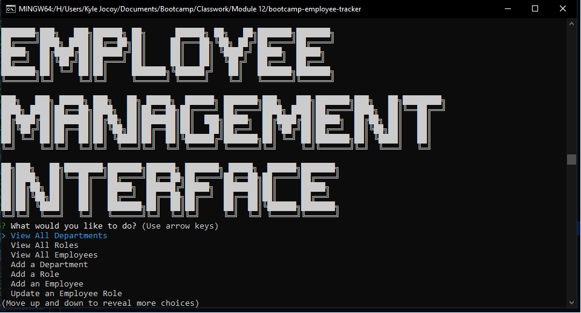

# Employee Tracker

## Summary

Simple CLI interface to access values and change them in MySQL without having to know SQL.

## Description

When index.js is run, the user is presented with "Employee Manager Interface" as an opening text with a menu below. The user can select from a list of tasks that can be run like adding/updating an employee, removing departments, job titles, and employees, as well as just selecting what they would like to view.

## Installation

- Git clone the folder
- Navigate to install folder
- run "npm i"
- run with "node index.js"

## User Story

```md
AS A business owner
I WANT to be able to view and manage the departments, roles, and employees in my company
SO THAT I can organize and plan my business
```

## Acceptance Criteria

```md
GIVEN a command-line application that accepts user input
WHEN I start the application
THEN I am presented with the following options: view all departments, view all roles, view all employees, add a department, add a role, add an employee, and update an employee role
WHEN I choose to view all departments
THEN I am presented with a formatted table showing department names and department ids
WHEN I choose to view all roles
THEN I am presented with the job title, role id, the department that role belongs to, and the salary for that role
WHEN I choose to view all employees
THEN I am presented with a formatted table showing employee data, including employee ids, first names, last names, job titles, departments, salaries, and managers that the employees report to
WHEN I choose to add a department
THEN I am prompted to enter the name of the department and that department is added to the database
WHEN I choose to add a role
THEN I am prompted to enter the name, salary, and department for the role and that role is added to the database
WHEN I choose to add an employee
THEN I am prompted to enter the employee’s first name, last name, role, and manager, and that employee is added to the database
WHEN I choose to update an employee role
THEN I am prompted to select an employee to update and their new role and this information is updated in the database
```

## Credits

- Donnie Rawlings: https://github.com/drawlin22
- Chelsea Wagner: https://github.com/caf62219
- John Young and office hours for finding a result() on the wrong line
- Phind for helping with just how to properly write Promises and async/await functions.
- Nedda Elsayed: https://github.com/lven-nemsy : showed how objects can be passed into db.query instead of using arrays.

## Links

Link to repo:  
https://github.com/Kylyote/bootcamp-employee-tracker  
Link to video:
https://drive.google.com/file/d/1Uv057NRkbpVUGB4CYIbuYCE6kVvw0Z4T/view

## Screenshot


